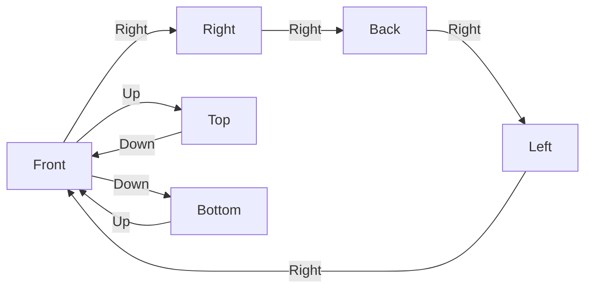

# Cube Screen Prototype 정리

## 1. 현재 구현 상태

플레이어를 중심으로 여섯 개의 World Space uGUI 면을 배치하고 `ViewerRig`를 90도씩 회전시키는 화면 프로토타입이다. 각 면은 별도 RenderTexture와 렌즈 프로필을 가지므로, 정면을 볼 때 함께 보이는 옆면·윗면·아랫면에도 각자의 렌즈 왜곡이 그대로 유지된다.

- Unity: 6000.5.4f1 / URP
- UI: World Space uGUI + TextMeshPro
- 최종 출력: 640×360 RenderTexture를 Point 필터로 확대하는 16:9 픽셀 화면
- Front/Back FOV: 63
- Right/Left FOV: 63
- Top FOV: 121.3
- Bottom FOV: 90.1
- 화면 전환: 90도, 0.45초, DOTween `Ease.InOutSine`
- 공통 버튼 Fade: 0.2초, DOTween `Ease.OutQuad`
- 마우스 가장자리 감지 폭: 44픽셀
- 오른쪽 마우스 드래그 최소 거리: 80픽셀

Front/Right/Back/Left/Bottom은 1280×720 Canvas와 16×9 Lens Quad의 명시적인 16:9 규격이다. Top은 방의 16×16 바닥·천장 단면을 덮기 위해 1280×1280 Canvas와 16×16 Lens Quad를 사용한다. Bottom은 Front 쪽 모서리를 붙인 채 z=3.5로 이동되어 있으며, 정면 진입 시 ViewerRig가 같은 방향으로 3.5 이동하고 FOV 90.1을 적용해 화면 전체에 맞춘다.

## 2. 중요 파일

| 파일 | 역할 |
| --- | --- |
| [`Assets/Scenes/CubeScreenPrototype.unity`](../Assets/Scenes/CubeScreenPrototype.unity) | 여섯 면, 렌즈 카메라, 공통 내비게이션, 픽셀 출력 구성 |
| [`Assets/CubeScreen/Runtime/CubeScreenController.cs`](../Assets/CubeScreen/Runtime/CubeScreenController.cs) | 화면 상태, 이동 제한, 키보드·드래그 입력, DOTween 회전/FOV 전환 |
| [`Assets/CubeScreen/Runtime/CubeNavigationOverlay.cs`](../Assets/CubeScreen/Runtime/CubeNavigationOverlay.cs) | 화면 가장자리 감지, 공통 버튼 표시 조건, DOTween Fade |
| [`Assets/CubeScreen/Runtime/CubeFaceLensDisplay.cs`](../Assets/CubeScreen/Runtime/CubeFaceLensDisplay.cs) | 면별 RenderTexture와 렌즈 값을 `MaterialPropertyBlock`으로 전달 |
| [`Assets/CubeScreen/Runtime/CubeFaceGraphicRaycaster.cs`](../Assets/CubeScreen/Runtime/CubeFaceGraphicRaycaster.cs) | UI 캡처 카메라와 포인터 판정 카메라 분리 |
| [`Assets/CubeScreen/Runtime/PixelPresentationViewport.cs`](../Assets/CubeScreen/Runtime/PixelPresentationViewport.cs) | 16:9 출력 영역과 UIEventCamera 입력 좌표 동기화 |
| [`Assets/CubeScreen/Shaders/CubeFaceLens.shader`](../Assets/CubeScreen/Shaders/CubeFaceLens.shader) | 방사형 왜곡, 줌, 색수차, 비네팅 렌즈 셰이더 |
| [`Assets/CubeScreen/Materials/CubeFaceLens.mat`](../Assets/CubeScreen/Materials/CubeFaceLens.mat) | 여섯 렌즈 표면이 공유하는 기본 재질 |
| [`Assets/CubeScreen/RenderTextures`](../Assets/CubeScreen/RenderTextures) | 면별 UI 캡처 RT와 최종 PixelFrame |
| [`Assets/Screenshots/CubeScreenSharedNav_front_78_final.png`](../Assets/Screenshots/CubeScreenSharedNav_front_78_final.png) | 원래 FOV 78로 복구한 Front 화면 확인 |
| [`Assets/Screenshots/CubeScreenSharedNav_back_final.png`](../Assets/Screenshots/CubeScreenSharedNav_back_final.png) | Back 렌즈 확인 |
| [`Assets/Screenshots/CubeScreenSharedNav_left_final.png`](../Assets/Screenshots/CubeScreenSharedNav_left_final.png) | Left 렌즈 확인 |
| [`Assets/Screenshots/CubeScreenSharedNav_top_final.png`](../Assets/Screenshots/CubeScreenSharedNav_top_final.png) | Top 렌즈와 세로 화면 확인 |
| [`Assets/Screenshots/CubeScreenSharedNav_bottom_final.png`](../Assets/Screenshots/CubeScreenSharedNav_bottom_final.png) | Bottom 단독 화면 확인 |

## 3. 씬 구조

```text
CubeScreenPrototype
├─ ViewerRig                         CubeScreenController
│  ├─ ViewerCamera                   640×360 PixelFrame 렌더링
│  └─ UIEventCamera                  면 UI 포인터 판정용 비활성 카메라
├─ PixelOutputCamera                 PixelPresentation을 Display 1에 출력
├─ EventSystem                       InputSystemUIInputModule
├─ Faces
│  ├─ Face_Front                     CubeFrontUI
│  ├─ Face_Right                     CubeRightUI
│  ├─ Face_Back                      CubeBackUI
│  ├─ Face_Left                      CubeLeftUI
│  ├─ Face_Top                       CubeTopUI
│  └─ Face_Bottom                    CubeBottomUI
├─ LensRenderRig
│  ├─ Capture_Front
│  ├─ Capture_Right
│  ├─ Capture_Back
│  ├─ Capture_Left
│  ├─ Capture_Top
│  └─ Capture_Bottom
├─ LensSurfaces
│  ├─ LensSurface_Front
│  ├─ LensSurface_Right
│  ├─ LensSurface_Back
│  ├─ LensSurface_Left
│  ├─ LensSurface_Top
│  └─ LensSurface_Bottom
└─ PixelPresentation                 Screen Space Camera Canvas
   ├─ Background
   ├─ PixelFrame                     640×360 결과를 Point 확대
   └─ NavigationOverlay              화면 전체 공통 내비게이션
      ├─ NavigateLeft
      ├─ NavigateRight
      ├─ NavigateUp
      └─ NavigateDown
```

각 `Face_*`에는 배경, 내부 패널, 프레임, 화면 번호, 제목, 힌트 등 해당 면의 콘텐츠만 들어 있다. 기존에 각 면마다 있던 24개의 방향 버튼은 모두 제거했다. 이동 버튼은 `PixelPresentation/NavigationOverlay` 아래의 네 개만 사용한다.

## 4. 화면 이동 규칙



왼쪽 이동은 가로 순환의 반대 방향이다.

| 현재 화면 | 허용 방향 | 공통 버튼 표시 가능 방향 |
| --- | --- | --- |
| Front | Left, Right, Up, Down | 네 방향 모두 |
| Right | Left, Right | 좌·우만 |
| Back | Left, Right | 좌·우만 |
| Left | Left, Right | 좌·우만 |
| Top | Down | Front 복귀용 아래만 |
| Bottom | Up | Front 복귀용 위만 |

Top에서 Up을 다시 누르거나 Bottom에서 Down을 다시 눌러도 회전하지 않는다. Right, Back, Left에서는 Up/Down 입력을 무시한다. 이 제한은 버튼 표시뿐 아니라 `CubeScreenController`에서도 검사하므로 키보드와 마우스 드래그에도 동일하게 적용된다.

## 5. 공통 내비게이션과 입력

`CubeNavigationOverlay`는 마우스 좌표가 화면의 상·하·좌·우 끝 44픽셀 영역에 들어왔는지 검사한다. 현재 화면에서 이동 가능한 방향일 때만 해당 `CanvasGroup`을 DOTween으로 0→1 Fade하고, 영역을 벗어나거나 이동 불가능한 방향이면 1→0 Fade한다. 숨겨진 버튼은 `interactable`과 `blocksRaycasts`도 꺼진다.

| 입력 | 동작 |
| --- | --- |
| 왼쪽 방향키 / `A` | 왼쪽 가로 화면 |
| 오른쪽 방향키 / `D` | 오른쪽 가로 화면 |
| 위 방향키 / `W` | Front→Top 또는 Bottom→Front |
| 아래 방향키 / `S` | Front→Bottom 또는 Top→Front |
| 오른쪽 마우스 드래그 | 드래그의 주축과 방향에 맞는 인접 화면 |
| 가장자리 공통 버튼 | 같은 방향의 컨트롤러 공개 메서드 호출 |

## 6. DOTween 애니메이션

직접 작성했던 코루틴, `AnimationCurve`, `Quaternion.SlerpUnclamped`, 수동 DeltaTime 보간은 제거했다.

- `CubeScreenController.BeginTurn()`은 하나의 DOTween `Sequence`에서 `DORotateQuaternion`, `DOMove`, 카메라 FOV `DOTween.To`를 동시에 실행한다.
- `SetUpdate(true)`를 사용하므로 `Time.timeScale`이 0이어도 화면 전환이 진행된다.
- 회전 중에는 `_turnSequence`가 존재하므로 추가 이동 입력을 차단한다.
- `CubeNavigationOverlay`는 각 `CanvasGroup`에 `DOFade`를 사용한다.
- 새 Fade가 시작되기 전 기존 대상 Tween을 `DOKill()`해 겹침을 막는다.

## 7. 면별 렌즈 파이프라인

```text
World Space uGUI
  → 면 전용 Capture Camera
  → 면 전용 RenderTexture
  → CubeFaceLens가 적용된 면 Quad
  → ViewerCamera
  → 640×360 PixelFrame
  → PixelOutputCamera / Display 1
```

| 면 | Distortion | Edge | Zoom | Chromatic | Vignette | 성격 |
| --- | ---: | ---: | ---: | ---: | ---: | --- |
| Front | -0.18 | 0.05 | 0.90 | 0.0025 | 0.08 | 오목한 배럴 계열 |
| Right | 0.22 | -0.05 | 1.10 | 0.0015 | 0.04 | Front와 반대 성향 |
| Back | 0.16 | -0.03 | 1.06 | 0.002 | 0.05 | 완만한 볼록 계열 |
| Left | -0.12 | 0.03 | 0.94 | 0.002 | 0.06 | 완만한 오목 계열 |
| Top | -0.08 | 0.02 | 0.97 | 0.001 | 0.03 | 약한 렌즈 효과 |
| Bottom | 0 | 0 | 1 | 0 | 0 | 일반 2D, 무왜곡 |

여섯 면 모두 같은 렌즈 파이프라인을 사용한다. Bottom만 파라미터를 중립값으로 둬 일반 2D처럼 보인다. 재질 하나를 공유하지만 `MaterialPropertyBlock`으로 면마다 다른 RenderTexture와 프로필을 전달한다.

전용 레이어는 Front 8, Right 9, Bottom 10, PixelOutput 11, Left 12, Back 13, Top 14다. ViewerCamera는 원본 UI 레이어를 제외하고 렌즈 Quad를 보며, 각 Capture Camera는 자기 면의 UI만 렌더링한다.

## 8. 면 연결과 화면 비율

- Front/Right/Back/Left/Bottom: Canvas 1280×720, Lens Quad 16×9, 캡처 RT 640×360
- Top: Canvas 1280×1280, Lens Quad 16×16, 캡처 RT 640×640
- 최종 출력 RT: 640×360, 16:9

기준 공간은 X 16, Y 9, Z 16이다. Front/Back은 z=±8, Right/Left는 x=±8, Top은 y=4.5에 놓여 서로 맞물린다. Bottom은 y=-4.5, z=3.5에 놓아 z=8인 Front 아래 모서리에 붙인다. 따라서 Bottom 뒤쪽과 Back 사이에는 7 유닛의 열린 영역이 남고 좌우 접합도 비대칭이지만, 이는 Bottom을 주 화면으로 유지하기 위해 현재 단계에서 의도적으로 허용한 트레이드오프다. 렌즈 셰이더는 불투명 깊이 렌더링을 유지한다.

## 9. Inspector 조절값

### `ViewerRig/CubeScreenController`

| 값 | 현재값 | 의미 |
| --- | ---: | --- |
| `Turn Duration` | 0.45 | 90도 화면 전환 시간 |
| `Drag Threshold` | 80 | 드래그 이동 최소 거리 |
| `Bottom Forward Offset` | 3.5 | Bottom 정면 진입 시 ViewerRig 전진 거리 |
| `Front Back Field Of View` | 63 | Front/Back과 인접 면 표시 |
| `Side Field Of View` | 63 | Right/Left와 인접 면 표시 |
| `Top Field Of View` | 121.3 | 16×16 Top 전체와 인접 면 표시 |
| `Bottom Field Of View` | 90.1 | Bottom 16:9 면 전체 일치 |
| `Turn Ease` | InOutSine | DOTween 위치/회전/FOV Ease |

플레이 시작 시 Front FOV 63을 적용한다. Bottom 진입 시에는 ViewerRig 위치도 Front 방향으로 3.5 이동하며, Bottom에서 복귀할 때 원래 중심으로 돌아온다. ViewerCamera와 UIEventCamera의 FOV는 항상 함께 보간한다.

### `PixelPresentation/NavigationOverlay`

| 값 | 현재값 | 의미 |
| --- | ---: | --- |
| `Edge Reveal Distance` | 44 | 포인터 가장자리 감지 폭 |
| `Fade Duration` | 0.2 | 버튼 Fade 시간 |
| `Fade Ease` | OutQuad | DOTween Fade Ease |

## 10. 이번 작업 내역

1. Bottom의 `SafeArea16x9`를 제거하고 UI를 1200×1200 물리 면 전체로 이동
2. Bottom 헤더를 Front 접합 모서리에 배치하고, 임시 FOV 92 테스트 후 기존 FOV 78로 복구
3. 여섯 면에 있던 개별 방향 버튼 24개 제거
4. `PixelPresentation`에 공통 상·하·좌·우 버튼 네 개와 `GraphicRaycaster` 추가
5. 포인터가 화면 끝에 접근할 때만 현재 이동 가능한 버튼을 Fade하는 `CubeNavigationOverlay` 추가
6. 직접 작성된 회전/FOV 보간 코드를 DOTween `Sequence`로 교체
7. 버튼 Fade도 DOTween `DOFade`로 구현
8. Left, Back, Top에 전용 UI 레이어, Capture Camera, RenderTexture, 렌즈 Quad와 프로필 추가
9. Bottom은 렌즈 파이프라인을 유지하되 중립값으로 일반 2D 출력
10. Unity MCP Play Mode에서 이동 규칙, 재입력 차단, Fade Tween, 여섯 렌즈와 픽셀 출력을 검증
11. 다섯 개의 16:9 면을 1280×720 / 16×9로 정규화하고 Top을 1280×1280 / 16×16으로 확장
12. 기준 공간을 X 16, Y 9, Z 16으로 재배치하고 Bottom을 Front 아래 모서리에 접합
13. Bottom 진입/복귀에 ViewerRig 위치 보간을 추가하고 면별 FOV를 63/63/121.3/90.1로 조정

## 11. 검증 결과

- 씬의 uGUI Button은 `NavigateLeft/Right/Up/Down` 네 개만 존재
- `CubeFaceLensDisplay` 6개와 `Capture_*` Camera 6개 존재
- Front에서 네 방향 모두 허용
- Right, Back, Left에서 좌우만 허용
- Top에서 Down만 허용하며 두 번째 Up은 회전값 변화 없음
- Bottom에서 Up만 허용하며 두 번째 Down은 회전값 변화 없음
- 가장자리 진입 시 Fade Tween 생성, 0.1초 시 alpha 0.75, 0.2초 시 alpha 1 확인
- Front/Right/Back/Left/Bottom 1280×720 / 16×9 / 640×360 확인
- Top 1280×1280 / 16×16 / 640×640 확인
- Front/Back 63, Right/Left 63, Top 121.3, Bottom 90.1 전환 확인
- Bottom 진입 시 ViewerRig z=3.5, 복귀 시 z=0으로 위치 보간 확인
- Bottom 진입 시 다른 면이 보이지 않고 Bottom만 화면을 채움
- Front에서 Bottom의 Front 접합부가 회색 바닥 영역으로 보임
- Back 하단 및 Side 한쪽 하단의 열린 영역은 현재 허용한 Bottom 비대칭으로 확인
- Back, Left, Top의 서로 다른 렌즈 왜곡 확인
- 640×360 Point 필터 최종 출력 확인
- Display 1 출력 카메라 정상 동작
- Play Mode 기능 확인 후 Console 오류·경고 0건

현재 검증은 Unity MCP를 통한 실제 Play Mode 검사다. 별도 Unity Test Framework 자동화 테스트는 아직 추가하지 않았다.

## 12. 다음 작업 후보

1. 임시 텍스트 대신 실제 픽셀 폰트와 Point 임포트 스프라이트 적용
2. Bottom 인벤토리/카드 UI를 실제 데이터와 연결
3. 화면별 최종 아트에 맞춰 여섯 렌즈 프로필 미세 조정
4. 강한 왜곡에서 작은 UI도 정확히 클릭되도록 렌즈 역왜곡 포인터 보정
5. 보이지 않는 면 Capture Camera를 비활성화해 GPU 비용 최적화
